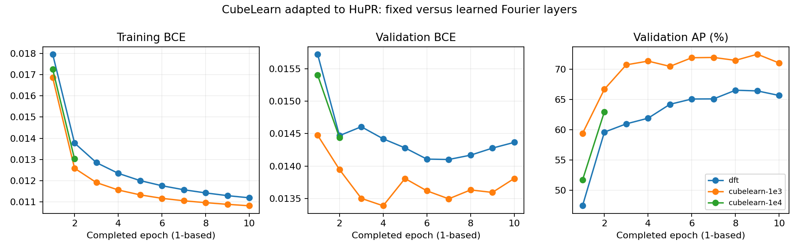
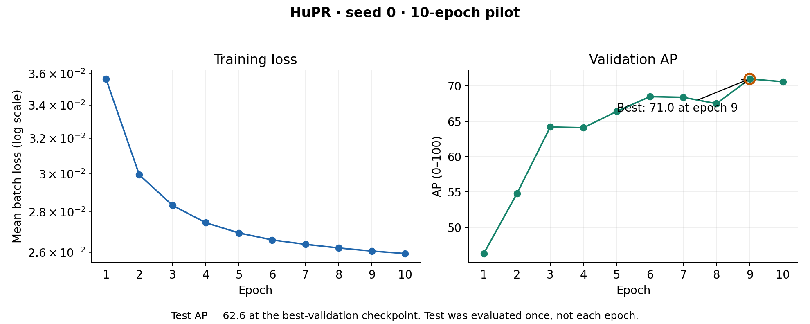

# HuPR reproduction and CubeLearn pose experiment

## Headline results

| Source | Test AP | AP50 | AP75 |
| --- | ---: | ---: | ---: |
| Our HuPR CSAM + PRGCN, 10 epochs | 62.6 | 96.7 | 73.4 |
| Published paper, CSAM + PRGCN | 63.4 | 97.0 | 74.0 |
| CubeLearn pose adaptation, learned Fourier layers | 59.06 | 93.27 | 66.00 |
| Matched pose adaptation, fixed DFT layers | 54.03 | 91.32 | 56.77 |

Paper values were verified against Table 3 of the [official WACV 2023 paper](https://openaccess.thecvf.com/content/WACV2023/papers/Lee_HuPR_A_Benchmark_for_Human_Pose_Estimation_Using_Millimeter_Wave_WACV_2023_paper.pdf). The paper does not specify an epoch count; 200 is the released configuration's default.

Our original HuPR test AP is **0.8 points below the paper**. For the original HuPR reproduction, we ran one training experiment: the released CSAM + PRGCN architecture, seed 0, 10 epochs, using the fast input pipeline.

| Stage | Runtime | Hardware / job |
| --- | ---: | --- |
| Training, 10 epochs | **6h 41m 07s** | One H100 / 307146 |
| Test evaluation, once | **4m 39s** | One H100 / 307147 |
| Combined allocation time | **6h 45m 46s** | Excludes queue wait and preprocessing |

Both jobs completed successfully; runtimes were rechecked with Slurm accounting on 2026-10-08.

## CubeLearn adapted to HuPR

Completed 2026-10-08 (cluster accounting date). This is a **new pose adaptation**, not a reproduction of a published CubeLearn pose result. Both arms trained for ten epochs with seed 0, and each was tested once on all 12,600 official test frames. Learned Fourier layers improve test AP by **5.03 points** over the matched fixed-DFT model. The learned adaptation remains **3.54 points below** our original HuPR run. One seed does not establish a statistically reliable advantage.

| Arm | Complex-layer LR | Best validation AP | Selected epoch (1-based) | Training allocations | Test allocation |
| --- | ---: | ---: | ---: | ---: | ---: |
| Fixed DFT | 0 | 66.50 | 8 | 2h 45m 12s | 1m 58s |
| CubeLearn | 0.001 | 72.46 | 9 | 2h 28m 42s | 2m 08s |

Each allocation used one H100 and 12 CPU cores. Training times include the selected pilot and interrupted/restarted allocations, including discarded partial-epoch work, but exclude queue wait and the separate lower-rate pilot (40m 47s). The three short throughput benchmarks cost another 1m 07s combined. Jobs ran concurrently; summing allocations is GPU resource time, not elapsed campaign wall time. [Exact accounting](reproduction/evidence/cubelearn-pose-20261008/slurm-accounting.psv) includes the historical intermediate RESIZING record for 318189; it is not an additional allocation.

Initial 64-GiB jobs repeatedly evicted raw-data file-cache pages. We resumed from completed checkpoints in 384-GiB allocations, keeping the model, batches and optimizer unchanged. Recorded file-cache refaults/reclaim disappeared in the new allocation. The last five completed epochs averaged 11.4 minutes for DFT and 11.5 minutes for CubeLearn, including validation. Nodes and cache conditions also changed; this is not a controlled estimate of RAM-only speedup. The recorded instantaneous GPU-utilization sample is not average utilization or MFU.

**Model and protocol.** Each radar uses a separate released CubeLearn D-A-T CNN–LSTM encoder with the six-class layer removed. Concatenated features feed a new 14-keypoint heatmap decoder (6,077,262 total parameters). Inputs are eight raw-ADC frames, 64 chirps, eight azimuth antennas and the first 128 ADC samples; no original HuPR normalized FFT cache is used. We retained the official 193/21/21 recording split, exact eight-frame alignment, Gaussian targets, 64-to-256 coordinate mapping and author COCO evaluator. Both arms use Adam, batch 8, real encoder/decoder LR 0.0003, constant rates, no weight decay, and one mean BCE heatmap loss. The original HuPR model has different architecture, input preprocessing and loss; its score is a contextual reference. The fixed/learned pair is the controlled comparison.

**Selection before testing.** Two learned pilots ran for two epochs: complex LR 0.0001 reached validation AP 62.94; LR 0.001 reached 66.66. We selected 0.001 from validation only and continued it to ten total epochs. The lower-rate pilot was not tested. DFT's initial allocation was moved after epoch 1 and also continued to ten. Each test loads the checkpoint with greatest full-validation AP, breaking ties with lower validation BCE. No settings or checkpoints were chosen using test scores, and no further seeds were run.



[Six fixed validation examples](reproduction/evidence/cubelearn-pose-20261008/validation_poses.png) show labels and predictions without camera images; they are qualitative examples, not additional test measurements. [Exact results and checkpoint hashes](reproduction/evidence/cubelearn-pose-20261008/results.json), [pilot selection](reproduction/evidence/cubelearn-pose-20261008/continuation-selection.json), and per-arm histories/logs are retained. Verification covered raw decoding/antenna mapping, all 600 temporal windows, DFT initialization and gradients, paired initial predictions, annotation equality, unchanged source hashes, finite checkpoints, best-validation selection and all 12,600 unique test image IDs.

[Experiment design and fresh-run commands](experiments/cubelearn_pose/EXPERIMENT.md) include the required CubeLearn fork commit and environment setup. Training/evaluation sources are frozen at their recorded hashes. Existing best/latest checkpoints, optimizer/RNG state and source snapshots remain under ignored `local/cubelearn-pose-20261008/`; both arms can resume without restarting. Raw recordings now live at `/mnt/weka/fgeikyan/rf-datas/hupr/`. The original raw-data path remains a compatibility link: frozen experiment sources and manifests retain their recorded paths so the epoch-10 checkpoints can still resume with unchanged source/configuration checks. The original HuPR pipeline and CubeLearn HAR model files were not changed.

### Continuation to 20 epochs (2026-10-09)

CubeLearn seed 0 was submitted to resume from the completed epoch-10 checkpoint to **20 total epochs**, keeping batch 8, real-network LR 0.0003, complex LR 0.001, Adam and the constant-rate schedule unchanged. Training job: **318360** (one H100, 12 CPUs, 384 GiB RAM, 3h30m limit); dependent best-validation test job: **318361**. No DFT continuation was submitted. The original ten-epoch checkpoints, history, test predictions and checksums were preserved under `local/cubelearn-pose-20261008/cubelearn-1e3/milestones/epoch-10/`. The headline table above retains the original ten-epoch comparison. The continuation completed successfully: test AP **60.55**, AP50 **95.40**, AP75 **69.26**, using the best-validation checkpoint at epoch **14** (validation AP **74.23**). The additional ten training epochs took **1h 59m 22s**, and testing took **1m 41s**. Test AP improved by **1.49** points over the ten-epoch learned run; DFT was not continued. Full commands and checkpoint/source verification are recorded in `local/cubelearn-pose-20261008/resume-20-20261009.json`.


### Continuation to 30 epochs (2026-10-09)

Submitted a further continuation from epoch 20 to **30 total epochs**, preserving all training settings and source files. Training job: **318772** (one H100, 12 CPUs, 384 GiB RAM, 3h30m limit); dependent best-validation test job: **318773**. Expected additional training is approximately two hours, excluding queue wait; this brings cumulative training allocations close to the original HuPR run's 6h41m. This is an approximate compute comparison, not a matched-architecture comparison. Existing best-validation state is retained, so an earlier checkpoint can still win. Epoch-20 checkpoints, metrics and predictions were copied and checksum-verified under `local/cubelearn-pose-20261008/cubelearn-1e3/milestones/epoch-20/`. Submission and exact commands: `local/cubelearn-pose-20261008/resume-30-20261009.json`. No DFT continuation was submitted; results are pending.

## Original HuPR experiment and convergence

Best validation AP was **71.0 at epoch 9** (stored as zero-based epoch 8). The test result above uses that checkpoint. The latest resumable checkpoint is after epoch 10. There are no additional training runs or multi-seed results for the released HuPR architecture. The CubeLearn pose adaptation above is a separate experiment.

Updated 2026-10-08. This reproduction is complete for our reporting scope: one 10-epoch, seed-0 run with the released CSAM + PRGCN model, evaluated once on the test set using the best-validation checkpoint. We are stopping here rather than extending to 200 epochs. This is a close short-run reproduction, not a multi-seed or full-duration reproduction.



[Epoch metrics](reproduction/evidence/epoch_metrics.csv), [training log](reproduction/evidence/train.log), [test log](reproduction/evidence/test.log).

## Protocol and changes

- Released train/validation/test sequence lists, sampling ratio 1, eight input frames, 14 keypoints, 64×64 heatmaps and 256×256 image coordinates. Predictions are scaled to image coordinates for evaluation as in the released code.
- Adam, batch size 20, weight decay 0.0001, initial LR 0.0001, no warmup. The unchanged scheduler multiplies LR by 0.999 at batch indices 0, 2000, 4000, etc. within each epoch. Ten epochs end at approximately 0.0000970; the schedule was not compressed.
- Model, loss, evaluator sources, optimizer settings and checkpoint selection remain the released implementation. The author's modified COCO evaluator must be installed; the fast launcher verifies its hashes.
- The fast pipeline reads pre-normalized float32 tensors, preserving the released normalization and frame selection. It uses 16 workers, pinned memory, prefetching and nonblocking transfers. `main.py` retains the original loader when `HUPR_NORMALIZED_CACHE` is unset.
- `resume.pth` adds model, optimizer, best validation AP and Python/NumPy/Torch/CUDA RNG state at epoch boundaries. CPU Adam save/reload equivalence was tested; bit-identical resumed GPU training is not claimed.
- No reduced-elevation-cache or rewritten-loss optimization from the later studies is enabled.

The original versus cached short benchmark measured 16.24 versus 73.65 samples/sec (4.53×). This is not an end-to-end run speed comparison. Later warm-cache profiling measured about 114 ms backward, 72 ms forward, 19 ms data wait, 15 ms loss and 12 ms transfer per batch. No individual-layer bottleneck was established. Experimental further optimizations reached ~106 versus ~86 samples/sec in a one-sequence benchmark without optimizer steps, but gradient differences remained unresolved; those experiments are archived only.

## Use the fast pipeline

Python 3.10, PyTorch 2.1.0 and torchvision 0.16.0 were used on an H100. [Requirements](reproduction/requirements.txt) and the [recorded environment](reproduction/evidence/environment.txt) are included. In a dedicated environment:

```bash
python -m pip install -r reproduction/requirements.txt
python reproduction/install_evaluator.py
```

The evaluator installer backs up and replaces `coco.py` and `cocoeval.py` in that Python environment, as required by the authors. Do not use a shared environment for another project's evaluator.

For an existing normalized cache, supply a data directory containing `hrnet_annot_train.json`, `hrnet_annot_val.json`, and `hrnet_annot_test.json`, and a cache directory containing `single_N/{hori.npy,vert.npy,complete.json}` for all configured sequences. Each cached view has shape `(600,8,2,64,64,8)` and dtype float32. Ground-truth JSON files are generated in the data directory, which must be writable by the launching account.

```bash
python run_fast.py --data /path/to/annotations --cache /path/to/cache --check
python run_fast.py --data /path/to/annotations --cache /path/to/cache --run new-seed0 --epochs 10
python run_fast.py --data /path/to/annotations --cache /path/to/cache --run new-seed0 --eval
```

A new run refuses to overwrite existing results. `--resume --epochs N` continues to a total of N epochs using the latest resumable checkpoint. Evaluation loads the best-validation model. The fast launcher requires at least one worker. `--seed` defaults to 0.

To regenerate cached inputs from the released preprocessed radar maps, run one sequence at a time (or independent jobs, without a concurrency cap):

```bash
python reproduction/build_cache.py --sequence 2 --data /path/to/preprocessed/HuPR --cache /path/to/new-cache
python reproduction/check_cached_loader.py --data /path/to/preprocessed/HuPR --cache /path/to/cache
```

The builder preserves normalization arithmetic and checks exact equality against the released transform at frames 0, 300 and 599 of each view. It refuses an existing sequence directory. Raw ADC conversion remains under the upstream `preprocessing/` instructions; building the normalized cache is a separate step after that preprocessing.

## Existing cluster assets and commands

Only `hupr/` remains as an active top-level HuPR folder. Historical campaigns, checkpoints and environments are under `../old/hupr-experiments/`. Dataset storage was consolidated on 2026-10-09: raw data is under `/mnt/weka/fgeikyan/rf-datas/hupr/`, and derived data is under its `derived/` folder. Old data locations are compatibility links, not additional copies. The joint HuPR/RF-CRATE attempt was moved intact, retaining its RF-CRATE assets too. Nothing was deleted. Historical scripts contain their old absolute paths and are provenance records; use this fork's launcher now.

Ignored local links keep the current setup usable:

- `local/data` → `/mnt/weka/fgeikyan/rf-datas/hupr/derived/pose-ground-truth`: annotations and generated ground truth.
- `local/normalized-cache` → `/mnt/weka/fgeikyan/rf-datas/hupr/derived/normalized-cache`: existing normalized cache.
- `local/raw-data` → `/mnt/weka/fgeikyan/rf-datas/hupr`: original ADC, frames and annotations.
- Released preprocessed HuPR maps: `/mnt/weka/fgeikyan/rf-datas/hupr/derived/preprocessed`.
- `local/env-hupr`: preserved Python environment. Invoke its interpreter directly; historical activation scripts contain old prefixes.
- `logs`: original pilot checkpoints and predictions, including `release-seed0/model_best.pth` and `resume.pth`.

Check everything without starting training:

```bash
/mnt/weka/fgeikyan/rf-perception-papers/hupr/local/env-hupr/bin/python /mnt/weka/fgeikyan/rf-perception-papers/hupr/run_fast.py --check
```

Optional fresh 10-epoch job from any current directory, under the account invoking `sbatch`:

```bash
HUPR_ROOT=/mnt/weka/fgeikyan/rf-perception-papers/hupr sbatch --export=ALL /mnt/weka/fgeikyan/rf-perception-papers/hupr/reproduction/run.sbatch --run new-seed0 --epochs 10
```

Evaluate the saved pilot checkpoint with the same job script and `--run release-seed0 --eval`, or continue with `--run release-seed0 --resume --epochs 20` (adjust job time for the intended work). No new GPU jobs were submitted during the earlier folder consolidation; the subsequent CubeLearn adaptation has its own campaign.

Large data, environments, predictions and checkpoints are intentionally local, not committed to Git. The fork contains the fast source, portable launcher/cache builder, setup instructions, compact results and verification evidence.
